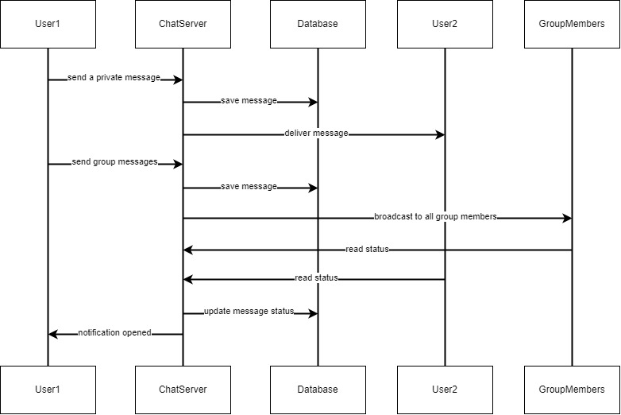
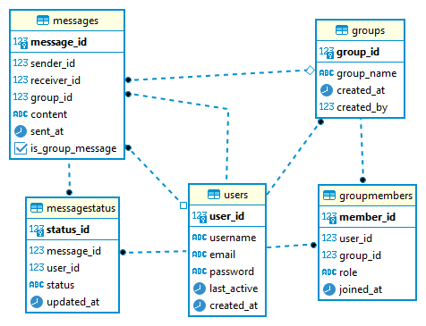

# Web Delopment Intern Qiscus

## Overview
This is the answer to my test when registering for a Qiscus internship as a web developer. The answer to each question includes:

### 1. Sequence Diagram for a chatting system that supports both group and single chat

### 2. Database structure for point (1) above using an Entity-Relationship Diagram (ERD).

### 3. Create a chat interface with a responsive view (web and mobile). 
My answer as a file is in the simple_chat.php file, while the deployment results can be seen directly at http://demo-live.free.nf Using the dummy JSON response below as the conversation data (https://bit.ly/chat_room_endpoint)

### 4. Extend the JSON format (payload) to display other message types containing images, videos, or PDFs. 
My answer as a file is in the enhanced_chat.php

### 5. Develop the chat page interface to display messages containing images, videos, or PDFs. Use the .json file created in the previous step as the conversation data.
My answer as a file is in the enhanced_chat.php file, while the deployment results can be seen directly at http://live-demo.free.nf